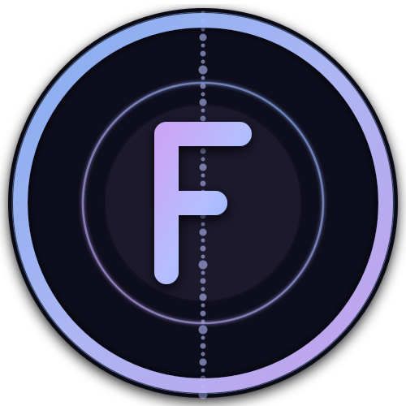

# My Dotfiles

<div align="center">

{:width="120px"}

[](https://github.com/FLT18355/dotfiles)
[](https://github.com/FLT18355/dotfiles)
[](LICENSE)

</div>

一套精心配置的开发环境 dotfiles，涵盖终端、编辑器、文件管理器、系统信息展示等工具。

---

## 目录

- [包含工具](#包含工具)
- [快速开始](#快速开始)
- [安装](#安装)
- [配置结构](#配置结构)
- [主题](#主题)
- [许可证](#许可证)

---

## 包含工具

| 工具 | 说明 |
|------|------|
| [Fish Shell](config/fish/) | 智能且友好的交互式 Shell，带 Catppuccin Tide 主题 |
| [Neovim](config/nvim/) | 基于 LazyVim 的现代化编辑器，支持 LSP、AI 补全 |
| [Herdr](config/herdr/) | 终端多路复用器，支持 AI Agent 集成 |
| [Yazi](config/yazi/) | 高性能终端文件管理器，带 Catppuccin 配色 |
| [Fastfetch](config/fastfetch/) | 系统信息展示，美观的终端横幅 |
| [OpenCode](config/opencode/) | 终端 AI 编程助手 |
| [Pip](config/pip/) | Python 包管理器镜像配置 |

---

## 快速开始

```bash
# 克隆本仓库到本地
git clone git@github.com:FLT18355/dotfiles.git ~/dotfiles
cd ~/dotfiles
```

---

## 安装

```bash
# 使用 stow 符号链接（推荐）
stow -t ~ fish nvim yazi fastfetch herdr opencode pip

# 或者手动复制到对应位置
cp -r config/fish ~/.config/fish
cp -r config/nvim ~/.config/nvim
cp -r config/yazi ~/.config/yazi
cp -r config/fastfetch ~/.config/fastfetch
cp -r config/herdr ~/.config/herdr
cp -r config/opencode ~/.config/opencode
cp -r config/pip ~/.config/pip
```

### 前置依赖

| 工具 | 安装方式 |
|------|----------|
| Fish Shell | `pacman -S fish` / `apt install fish` |
| Neovim | `pacman -S neovim` / `apt install neovim` |
| Yazi | `pacman -S yazi` / `cargo install yazi-fm` |
| Fastfetch | `pacman -S fastfetch` / `apt install fastfetch` |
| Herdr | `cargo install herdr` 或从 [herdr.dev](https://herdr.dev) 获取 |
| Starship | `pacman -S starship`（可选，Fish 提示符） |

### 推荐插件

```bash
# Fish 插件（使用 Fisher）
fisher install jorgebucaran/fisher
fisher install PatrickF1/fzf.fish
fisher install PatrickF1/autopair.fish
fisher install Kathlyn/puffer-fish-key-bindings
fisher install frikky/sponge
fisher install Illystrill/abbr-tips.fish

# Neovim 插件（LazyVim 会自动安装大部分）
# Mason 手动安装 LSP/工具
:Mason

# Yazi 插件
ya pack -a yazi-rs/plugins:full
ya pack -a stonemetal/starship.yazi
```

---


## 主题

本项目默认使用 **[Catppuccin](https://catppuccin.com/)** 配色方案，支持 Mocha、Macchiato、Frappe、Latte 四个变体。

### Fish Shell

```fish
# 在 config.fish 中切换主题和风格
catppuccin_tide mocha lean     # 默认
catppuccin_tide latte classic
catppuccin_tide frappe rainbow
```

### Herdr

```toml
# config/herdr/config.toml
[theme]
name = "catppuccin-latte"
```

可选主题：`catppuccin`、`terminal`、`tokyo-night`、`dracula`、`nord`、`gruvbox`、`one-dark`、`solarized`、`kanagawa`、`rose-pine`、`vesper`

### Yazi

```toml
# config/yazi/theme.toml
[theme]
bg = "material.theme.mocha.base"
```

### Neovim

```lua
-- config/nvim/init.lua
vim.cmd.colorscheme("catppuccin")
```

---

## 许可证

本项目基于 [Apache License 2.0](LICENSE) 开源。
